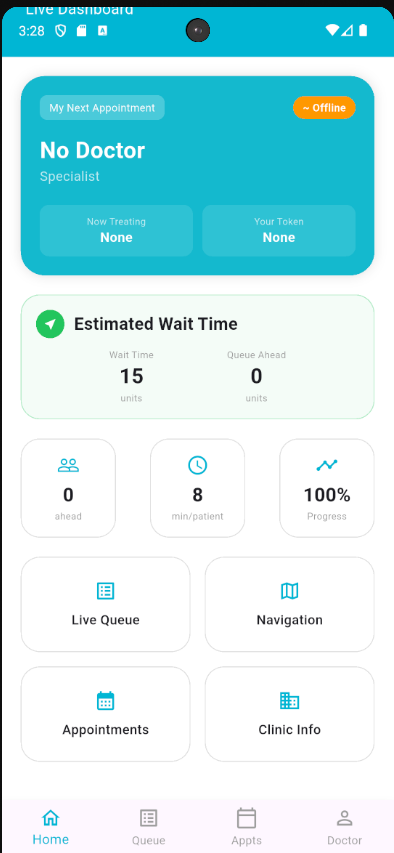
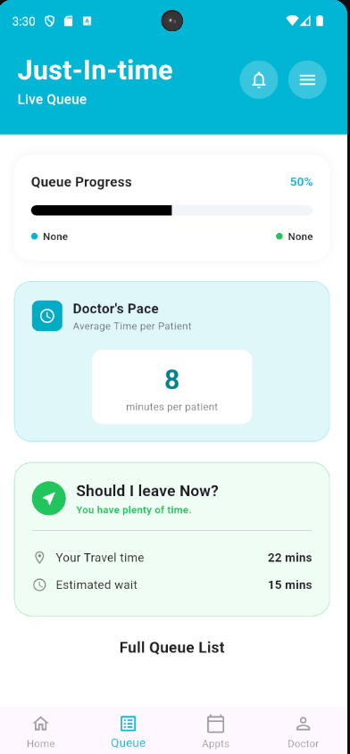

# ⏱️ Just In Time - Real-Time Patient Scheduling & Alerts

> **"Time is the most valuable medicine."**
> *Just In Time* is a dynamic healthcare ecosystem that treats a patient's time as a priority. By replacing static, broken appointment slots with a living, breathing queue, our system calculates the exact moment a patient needs to leave their house, ensuring they arrive **Just In Time** for their consultation.

---

## 👥 Team Zybots
* **240361V** - L.H.H.R. Kumar
* **240470E** - K.A.R. Nishaya
* **240553L** - W.B.Y. Ranaweera
* **240558G** - J.L.E. Rathnapala
* **240710R** - W.W.N.D. Wickramarathna

---

## 💡 The Problem vs. Our Solution
Traditional hospital appointment systems rely on fixed time slots, which fail to adapt to real-time delays caused by emergencies or varying consultation durations. This leads to overcrowded waiting areas and frustrated patients.

**Our Solution:** We synchronize patient arrival times with a doctor's real-time availability using **Object-Oriented Design**. 
* **🕒 Zero-Waste Timing:** Real-time sync between the doctor's office and the patient's doorstep.
* **🧠 Adaptive Logic:** Adjusts for emergencies and consultation variances instantly.
* **📡 IoT Driven:** Uses ESP32 hardware to detect room readiness automatically.

---

## 🛠️ Tech Stack
* **Frontend:** Flutter (Dart)
* **Backend:** Java Spring Boot (REST API & WebSockets)
* **Database:** MySQL / PostgreSQL
* **Hardware:** IoT (ESP32) for room status detection
* **Machine Learning:** Predictive modeling for consultation durations

---

## 📂 Project Structure (Monorepo)
```text
/just-in-time
  ├── /frontend       # Flutter mobile application
  ├── /backend        # Java Spring Boot backend
  ├── /hardware       # C++/Arduino code for ESP32 sensors
  ├── /docs           # OOSD reports, UML diagrams, NFR tables
  └── /designs        # UI assets and design exports
```

---

## 🎨 UI Design & Prototype

### Scrollable UI Screens
### Login Screen


### Details Screen


### Queue Managing Screen


### Interactive Prototype
[Click here to view the prototype](https://www.figma.com/design/WClz5aN7DWuVeWLIeBFWdM/Medi_Help?node-id=27-341&t=xPMZwsn3gtXQv8y3-1)

---

## 🔌 Hardware Integration (IoT)


We are integrating an **ESP32** microcontroller to send real-time room readiness and patient presence signals to the backend system. This ensures the queue is updated the millisecond a consultant is ready for the next patient.
